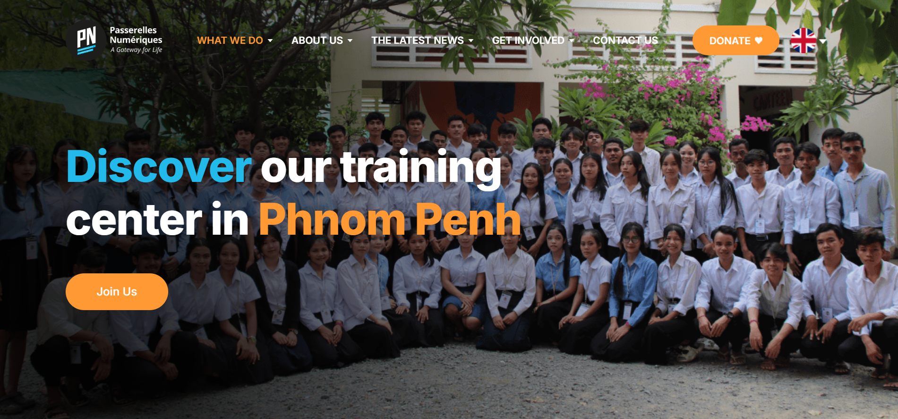
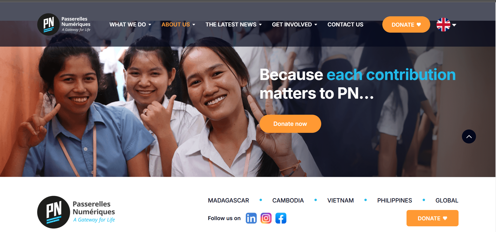

# Schoolmanagement


## Screenshorts
### Home page



### About page


### Contact page


### Service page


---
## Functions

### Home page
 first the hompage will apply for  PNC.

### About page
first the aboutpag will apply for about PNC. Aboutpage have a lot of story at PNC.

### Contact page
first the contactpage will apply for Address Email Phone.

### Service page
first the servicepage will apply for student, activity, and evant.

## Drawbacks
- On update page of homepage, aboutpage, contactpage, and servicepage you must have to update password
- Anyone can become Member.

## How to run this project
- Install Python(3.7.6) (Dont Forget to Tick Add to Path while installing Python)
- Open Terminal and Execute Following Commands :

``` python -m pip install -r requirements.txt ``` 

- Downloas This Project Zip Folder and Extract it
- Move to project folder in Terminal. Then run following Commands :

``` py manage.py makemigrations
py manage.py migrate
py manage.py runserver
```

- Now enter following URL in Your Browser Installed On Your Pc

``` 
http://127.0.0.1:8000/
```
## CHANGES REQUIRED FOR CONTACT US PAGE
- In settins.py file, You have to give your email and password

```
EMAIL_HOST_USER = 'youremail@gmail.com'
EMAIL_HOST_PASSWORD = 'your email password'
EMAIL_RECEIVING_USER = 'youremail@gmail.com'
```
- Login to gmail through host email id in your browser and open following link and turn it ON
```
https://www.passerellesnumeriques.org/what-we-do/cambodia/
```
## Disclaimer
This project is developed for demo purpose and it's not supposed to be used in real application.

## Feedback
Any suggestion and feedback is welcome. You can message me on facebook
- [Contact on Facebook](https://www.facebook.com/passerelles.numeriques.cam/)
- [Subscribe to LazyCoder on YouTube](https://www.youtube.com/user/PasserellesNumerique)
